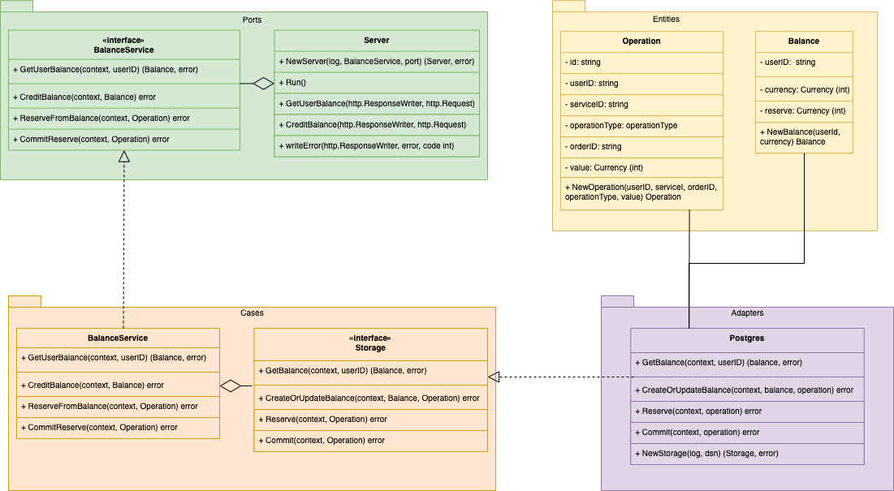

# Тестовое задание на позицию стажёра-бэкендера

## Микросервис для работы с балансом пользователей

**Задача:**

Необходимо реализовать микросервис для работы с балансом пользователей (зачисление средств, списание средств, перевод средств от пользователя к пользователю, а также метод получения баланса пользователя). Сервис должен предоставлять HTTP API и принимать/отдавать запросы/ответы в формате JSON.

**Основное задание**

Метод начисления средств на баланс. Принимает id пользователя и сколько средств зачислить.
Метод резервирования средств с основного баланса на отдельном счете. Принимает id пользователя, ИД услуги, ИД заказа, стоимость.
Метод признания выручки – списывает из резерва деньги, добавляет данные в отчет для бухгалтерии. Принимает id пользователя, ИД услуги, ИД заказа, сумму.
Метод получения баланса пользователя. Принимает id пользователя.

**Диаграмма классов**

**Решенные задачи**

- Метод начисления средств на баланс. Принимает id пользователя и сколько средств зачислить.
- Метод получения баланса пользователя. Принимает id пользователя.
